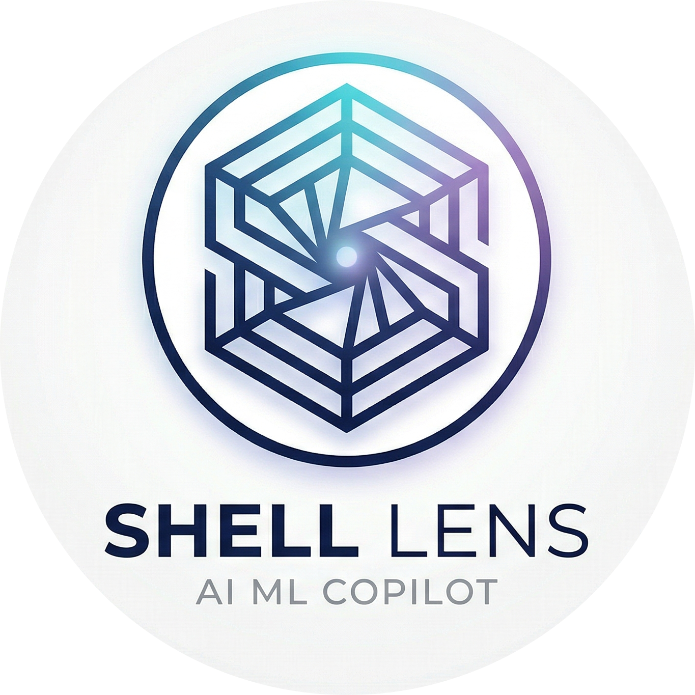

<div align="center">
  
  <h1>Shell Lens</h1>
  <p><strong>Terminal-First Agentic AI Copilot for Machine Learning Engineers</strong></p>
  <p>
    
    
    
  </p>
</div>

---

## What is Shell Lens?

**Shell Lens** is NOT a chatbot. NOT a simple code generator. NOT just another AutoML wrapper.

Shell Lens is a **terminal-first, agentic AI copilot** built specifically for Machine Learning Engineers who do not want to manually handle repetitive data science and data engineering work.

Think of Shell Lens as an **intelligent ML teammate** that can think, plan, execute, evaluate, and improve its own decisions — step by step.

> **Query → Understand → Plan → Execute → Reflect → Adapt → Respond**

---

## Core Capabilities

Shell Lens helps you:

- 📊 **Analyze datasets** — summaries, statistics, distributions
- 🔗 **Understand feature relationships** — correlations, dependencies
- 🔍 **Detect data quality issues** — missing values, skewness, outliers, imbalance, leakage
- 🔧 **Suggest preprocessing steps** — imputation, encoding, scaling strategies
- 🤖 **Recommend models** — matched to your task and data profile
- 📈 **Suggest evaluation metrics** — appropriate for your problem type
- ⚙️ **Generate ML pipelines** — lightweight, actionable, end-to-end
- 🩺 **Diagnose ML problems** — low accuracy, overfitting, data leakage, bad feature selection
- 🪜 **Execute step-by-step** — instead of giving one-shot answers

---

## Design Philosophy

Shell Lens is built around one core idea: **reduce manual effort before model training**.

Every action Shell Lens takes follows these principles:

- ✅ Think before acting
- ✅ Break tasks into smaller executable steps
- ✅ Execute only one step at a time
- ✅ Evaluate the result of each step
- ✅ Decide whether to continue, replan, or stop
- ✅ Prefer deterministic tools over hallucinated code
- ✅ Give actionable ML insights instead of generic summaries

---

## Architecture

Shell Lens is built on a **modular multi-agent architecture** orchestrated by **LangGraph**.

### Agents

| Agent | Role |
|---|---|
| `IntentAgent` | Understands what the user wants |
| `GoalAgent` | Handles goal-oriented tasks (prediction, regression, forecasting, etc.) |
| `PlannerAgent` | Breaks tasks into small, executable steps |
| `ExecutionAgent` | Chooses how to perform each step (tool or code) |
| `ReflectionAgent` | Evaluates whether the step succeeded |
| `ReasoningAgent` | Synthesizes findings and recommendations |
| `ResponseAgent` | Formats the final response |
| `ProfilerAgent` | Understands dataset characteristics |
| `VisualizationAgent` | Decides whether and what to visualize |

### LangGraph Flow

Shell Lens is controlled by a **LangGraph state machine**, not a linear orchestrator.

```
Intent → Goal → Planner → Step → Execution → Reflection → Step Control
```

After **Step Control**, Shell Lens dynamically decides what to do next based on `ReflectionAgent` output:

```json
{
  "decision": "continue | replan | stop",
  "reason": "...",
  "issues": [],
  "confidence": 0.0
}
```

Shell Lens is **adaptive** — it can change strategy mid-execution without user intervention.

---

## Execution System

### Tool-First Approach

Shell Lens always **prefers deterministic tools** over LLM-generated code.

`ExecutionAgent` outputs one of two formats:

**Tool usage (preferred):**
```json
{
  "type": "tool",
  "tool_name": "describe_data",
  "args": {}
}
```

**Fallback code generation:**
```json
{
  "type": "code",
  "code": "df['income_per_age'] = df['income'] / df['age']"
}
```

Code is only generated when no existing tool fits the task.

### Built-in Tools

Shell Lens ships with deterministic tools for common ML tasks:

- Dataset summary & profiling
- Missing value detection
- Feature statistics
- Correlation heatmaps
- Histogram plotting
- Linear model training
- Data quality checks
- Outlier & skewness detection

### Code Execution

For complex or unsupported tasks, `ExecutionAgent` can generate and safely execute Python code using:

- `pandas` · `numpy` · `matplotlib` · `seaborn`
- `sklearn` · `scipy` · `statsmodels`

The **Executor** runs this code in a controlled environment, capturing stdout, return values, and errors — and feeding results back into Shell Lens's state.

---

## Visualization

Visualization is **lightweight and tool-based**.

`VisualizationAgent` only decides:
- Whether visualization is useful
- Which chart type is appropriate
- Which columns to visualize

```json
{
  "should_visualize": true,
  "plot_type": "histogram",
  "column": "price"
}
```

`ExecutionAgent` then converts this into a tool call or plotting code. Supported chart types include: histograms, correlation heatmaps, scatter plots, box plots, and feature distributions.

---

## Installation

Choose the installation method that works best for you.

---

### Option 1 — pip (Standard)

> Recommended for developers and ML engineers who already have Python 3.10+ installed.

```bash
# Clone the repository
git clone https://github.com/ath34-tech/shellens.git
cd shellens

# Install in editable mode
pip install -e .
```

**Requirements:** Python 3.10+, pip

---

### Option 2 — Standalone Executable (Windows)

> No Python installation required. Download and run immediately.

1. Go to the [**Releases**](https://github.com/ath34-tech/shellens/releases) page
2. Download the latest `Shell Lens.exe` from the Assets section
3. Place `Shell Lens.exe` in any folder you prefer (e.g. `C:\Tools\shellens\`)
4. Add that folder to your system `PATH` so you can run `shellens` from any terminal
5. Open a terminal and verify:

```cmd
shellens --help
```

> **Note:** Advanced ML operations (e.g. custom sklearn pipelines, seaborn plots) may require the relevant Python packages to be present on your machine.

---

### Option 3 — uv (Fast Python Toolchain)

> Recommended if you use [uv](https://github.com/astral-sh/uv) as your Python package manager.

```bash
# Install uv if you haven't already
curl -Ls https://astral.sh/uv/install.sh | sh

# Clone and install Shell Lens
git clone https://github.com/your-username/shellens.git
cd shellens

# Create a virtual environment and install
uv venv
uv pip install -e .

# Activate the environment
# On Windows:
.venv\Scripts\activate
# On macOS/Linux:
source .venv/bin/activate
```

> `uv` is significantly faster than pip for dependency resolution and installation.

---

## Configuration

Before running Shell Lens, configure your credentials. You can set them once with `shellens config` and they will be persisted to a local `.env` file for all future sessions.

```bash
# Set your Groq API key (required)
shellens config --groq-key YOUR_GROQ_API_KEY

# Optionally set a specific Groq model
shellens config --model-name llama-3.1-8b-instant

# Optionally configure Kaggle credentials (for dataset downloads)
shellens config --kaggle-username YOUR_KAGGLE_USERNAME --kaggle-key YOUR_KAGGLE_KEY
```

All values are saved to `.env` at the project root and automatically reloaded on the next run.

---

## CLI Reference

Shell Lens is **terminal-first**. Every command is designed to feel like a developer tool, not a chat app.

### `shellens config`

Persist credentials and settings to the local `.env` file.

```bash
shellens config [OPTIONS]

Options:
  --groq-key TEXT          Set your Groq API key
  --model-name TEXT        Set the Groq model to use (e.g. llama-3.1-8b-instant)
  --kaggle-username TEXT   Set your Kaggle username
  --kaggle-key TEXT        Set your Kaggle API key
```

---

### `shellens load-file`

Load a local dataset (CSV, Parquet, or Excel) into the session context.

```bash
shellens load-file path/to/dataset.csv
shellens load-file path/to/dataset.parquet
shellens load-file path/to/dataset.xlsx
```

> `shellens load-data` is an alias for the same command.

---

### `shellens load-kaggle`

Download and load a dataset directly from Kaggle.

```bash
shellens load-kaggle username/dataset-name

# Optionally pass credentials inline
shellens load-kaggle username/dataset-name --username YOUR_USERNAME --key YOUR_KAGGLE_KEY
```

Kaggle credentials can also be pre-set via `shellens config`.

---

### `shellens chat`

Start an interactive agentic session. This is the main command for querying Shell Lens.

```bash
shellens chat

# Optionally override credentials for this session only
shellens chat --api-key YOUR_GROQ_API_KEY
shellens chat --model-name llama-3.1-8b-instant
shellens chat --kaggle-username YOUR_USERNAME --kaggle-key YOUR_KEY
```

Once inside the session, type any natural language question and Shell Lens will think, plan, execute, reflect, and respond.

Type `exit` or `quit` to end the session.

---

## Usage Tutorial

This tutorial walks you through a real end-to-end Shell Lens workflow.

---

### Step 1 — Configure Credentials

Run this once. Your settings are saved and reused in every future session.

```bash
shellens config --groq-key YOUR_GROQ_API_KEY
```

To also set a model and Kaggle access:

```bash
shellens config \
  --groq-key YOUR_GROQ_API_KEY \
  --model-name llama-3.1-8b-instant \
  --kaggle-username YOUR_USERNAME \
  --kaggle-key YOUR_KAGGLE_KEY
```

---

### Step 2 — Load Your Dataset

#### From a local file:

```bash
shellens load-file path/to/housing.csv
```

#### From Kaggle:

```bash
shellens load-kaggle ath34-tech/housing-prices-dataset
```

Shell Lens will confirm the file is loaded and ready for querying.

---

### Step 3 — Start a Chat Session

```bash
shellens chat
```

You'll see the Shell Lens prompt:

```
Welcome to Shell Lens AI! Type 'exit' to quit.

>>
```

From here, ask anything about your data in plain English.

---

### Step 4 — Query Shell Lens

Inside the chat session, Shell Lens handles everything through natural language. Some example queries:

```
>> What does this dataset look like? Summarize its structure.
>> Are there any missing values? How should I handle them?
>> What features are most correlated with the target column?
>> Is there any risk of data leakage in this dataset?
>> Detect any outliers in the price column.
>> What model would you recommend for a regression task on this data?
>> What preprocessing steps should I apply before training?
>> Show me a correlation heatmap of all numeric features.
>> Why might a model trained on this data be overfitting?
>> Generate a lightweight ML pipeline for predicting house_price.
```

Shell Lens will **think → plan → execute step-by-step → reflect → adapt**, all without you writing a single line of code.

---

### Full Workflow Example

```bash
# Step 1: Configure once
shellens config --groq-key sk-your-key-here --model-name llama-3.1-8b-instant

# Step 2: Load a local dataset
shellens load-file housing.csv

# Step 3: Enter the chat session
shellens chat
```

```
Welcome to Shell Lens AI! Type 'exit' to quit.

>> What are the most important features for predicting house_price?

 Thinking...

Shell Lens AI:
┌─────────────────────────────────────────────────────────────────┐
│ Based on correlation analysis:                                  │
│                                                                 │
│ Top features correlated with house_price:                       │
│  • OverallQual  → 0.79                                          │
│  • GrLivArea    → 0.71  (⚠ skewed, consider log-transform)     │
│  • GarageCars   → 0.64                                          │
│  • TotalBsmtSF  → 0.61                                          │
│                                                                 │
│ Recommendation: Apply log1p to GrLivArea before training.       │
└─────────────────────────────────────────────────────────────────┘
```

---

## Future Vision

- 🧠 Richer memory and session continuity
- 🔧 Expanded deterministic toolset
- 🤖 AutoML-lite pipelines
- 📊 Experiment tracking integration
- 🔎 Advanced visualization reasoning
- 🖥️ VS Code extension
- 🩺 Enhanced diagnosis mode
- 🔀 More advanced LangGraph routing

---

## Tech Stack

| Layer | Technology |
|---|---|
| Orchestration | LangGraph |
| CLI | Typer |
| Data | pandas, numpy |
| ML | scikit-learn, scipy, statsmodels |
| Visualization | matplotlib, seaborn |
| LLM Backend | Groq (configurable) |

---

<div align="center">
  <sub>Built for ML Engineers who want to move faster — without cutting corners.</sub>
</div>
